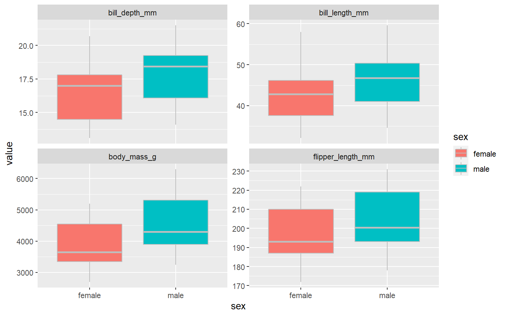
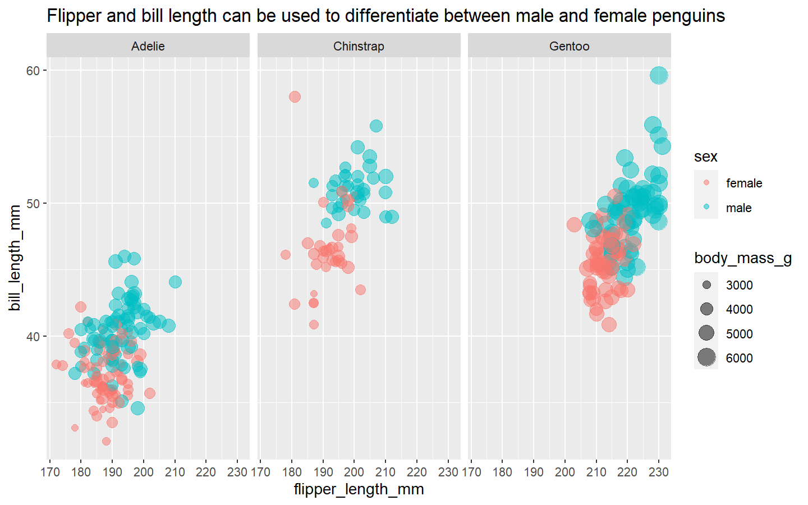
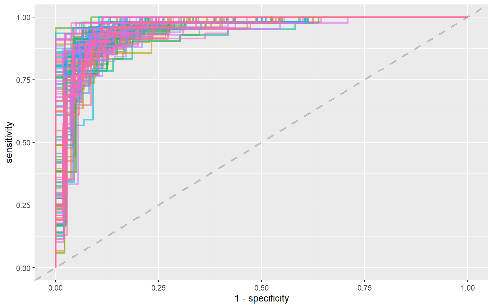
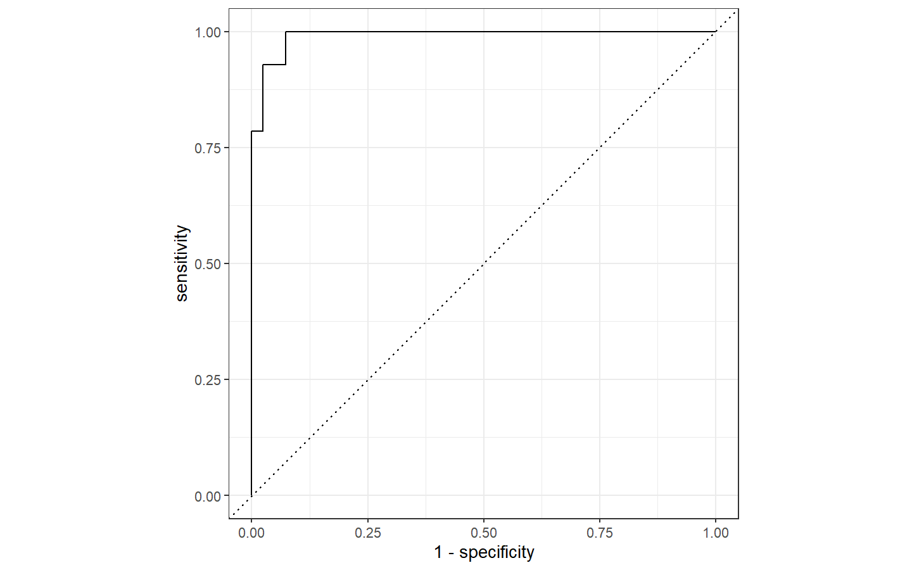

Tidymodels and Classification on Palmer Penguin Data
================
Gaurav Sharma
27/08/2020

### Reading the files

``` r
ttfile <- tidytuesdayR::tt_load('2020-07-28')
```

    ## 
    ##  Downloading file 1 of 2: `penguins.csv`
    ##  Downloading file 2 of 2: `penguins_raw.csv`

``` r
penguins <- ttfile$penguins
```

### let’s explore the data to see if we can find some good features to classify male and female penguins

``` r
penguins %>% 
    drop_na() %>%
    pivot_longer(bill_length_mm:body_mass_g, names_to = 'spec', values_to = 'value') %>% 
    ggplot(aes(x= value, y = sex, fill = sex)) +
    geom_boxplot(color = "gray") +
    facet_wrap(~spec, scales = "free_y") +
    coord_flip() +
    labs(title = "Body Specs clearly show a difference in male and female penguins")
```

<!-- -->

``` r
penguins %>% 
    filter(!is.na(sex)) %>% 
    ggplot(aes(flipper_length_mm, bill_length_mm, color = sex, size = body_mass_g)) +
    geom_point(alpha = 0.5) +
    facet_wrap(~species) +
    labs(title = "Flipper and bill length can be used to differentiate between male and female penguins")
```

<!-- -->

### Lets drop the NAs and finalize the data that we are going to use for modelling

``` r
penguins_df <- penguins %>% 
    drop_na() %>% 
    select(-c(year, island)) %>% 
    mutate(sex = as_factor(sex))
```

### Lets create a split to get our training and testing datasets

``` r
set.seed(123)
penguin_split <- penguins_df %>% 
    initial_split(strata = sex)

penguin_train <- training(penguin_split)
penguin_test <- testing(penguin_split)
penguin_split
```

    ## <Analysis/Assess/Total>
    ## <250/83/333>

### As we don’t have a lot of data hence it makes sense to create resamples to evaluatethe model properly. We will save the test set for final generalization.

``` r
set.seed(234)
penguin_boot <- penguin_train %>% 
    bootstraps(times = 100)
penguin_boot
```

    ## # Bootstrap sampling 
    ## # A tibble: 100 x 2
    ##    splits           id          
    ##    <list>           <chr>       
    ##  1 <split [250/93]> Bootstrap001
    ##  2 <split [250/99]> Bootstrap002
    ##  3 <split [250/93]> Bootstrap003
    ##  4 <split [250/99]> Bootstrap004
    ##  5 <split [250/92]> Bootstrap005
    ##  6 <split [250/91]> Bootstrap006
    ##  7 <split [250/85]> Bootstrap007
    ##  8 <split [250/93]> Bootstrap008
    ##  9 <split [250/90]> Bootstrap009
    ## 10 <split [250/89]> Bootstrap010
    ## # ... with 90 more rows

### lets create classification models now. We will create two models. A logistic regression model and a random forest model. Let’s create specs for these two models.

``` r
glm_spec <- logistic_reg() %>% 
    set_engine(engine = 'glm') %>% 
    set_mode(mode = "classification")
glm_spec
```

    ## Logistic Regression Model Specification (classification)
    ## 
    ## Computational engine: glm

``` r
rf_spec <- rand_forest() %>% 
    set_mode(mode = "classification") %>% 
    set_engine(engine = "ranger")
rf_spec
```

    ## Random Forest Model Specification (classification)
    ## 
    ## Computational engine: ranger

### Lets create a workflow now to combine the specs and data and define a standardized workflow for modelling

``` r
penguin_wf <- workflow() %>% 
    add_formula(sex~.)
penguin_wf
```

    ## == Workflow ===========================================================================================================
    ## Preprocessor: Formula
    ## Model: None
    ## 
    ## -- Preprocessor -------------------------------------------------------------------------------------------------------
    ## sex ~ .

### Lets train our first model which is a logistic regression model

``` r
glm_rs <- penguin_wf %>% 
    add_model(glm_spec) %>% 
    fit_resamples(resamples = penguin_boot,
                  control = control_resamples(save_pred = TRUE), 
                  verbose = TRUE)

rf_rs <- penguin_wf %>% 
    add_model(rf_spec) %>% 
    fit_resamples(resamples = penguin_boot,
                  control = control_resamples(save_pred = TRUE), 
                  verbose = TRUE)
```

### Lets have a look at the performances of these models

``` r
glm_rs %>% 
    collect_metrics()
```

    ## # A tibble: 2 x 5
    ##   .metric  .estimator  mean     n std_err
    ##   <chr>    <chr>      <dbl> <int>   <dbl>
    ## 1 accuracy binary     0.896   100 0.00273
    ## 2 roc_auc  binary     0.963   100 0.00165

``` r
rf_rs %>% 
    collect_metrics()
```

    ## # A tibble: 2 x 5
    ##   .metric  .estimator  mean     n std_err
    ##   <chr>    <chr>      <dbl> <int>   <dbl>
    ## 1 accuracy binary     0.897   100 0.00297
    ## 2 roc_auc  binary     0.962   100 0.00143

``` r
glm_rs %>% 
    collect_predictions() %>% 
    group_by(id) %>% 
    roc_curve(sex, .pred_female) %>% 
    ggplot(aes(1-specificity, sensitivity, color = id)) +
    geom_abline(lty=2, size = 1, color = "gray") +
    geom_path(show.legend = F, size = 1, alpha = 0.6)
```

<!-- -->

### Finally lets fit this model to our test data and see how performs

``` r
penguin_final <- penguin_wf %>% 
  add_model(glm_spec) %>% 
  last_fit(penguin_split)
  
penguin_final
```

    ## # Monte Carlo cross-validation (0.75/0.25) with 1 resamples  
    ## # A tibble: 1 x 6
    ##   splits       id           .metrics      .notes       .predictions    .workflow
    ##   <list>       <chr>        <list>        <list>       <list>          <list>   
    ## 1 <split [250~ train/test ~ <tibble [2 x~ <tibble [1 ~ <tibble [83 x ~ <workflo~

``` r
penguin_final %>% 
  collect_metrics()
```

    ## # A tibble: 2 x 3
    ##   .metric  .estimator .estimate
    ##   <chr>    <chr>          <dbl>
    ## 1 accuracy binary         0.940
    ## 2 roc_auc  binary         0.991

``` r
penguin_final %>% 
  collect_predictions() %>% 
  conf_mat(sex, .pred_class)
```

    ##           Truth
    ## Prediction male female
    ##     male     39      2
    ##     female    3     39

``` r
penguin_final %>% 
  collect_predictions() %>% 
  roc_curve(sex, .pred_female) %>% 
  autoplot()
```

<!-- -->
