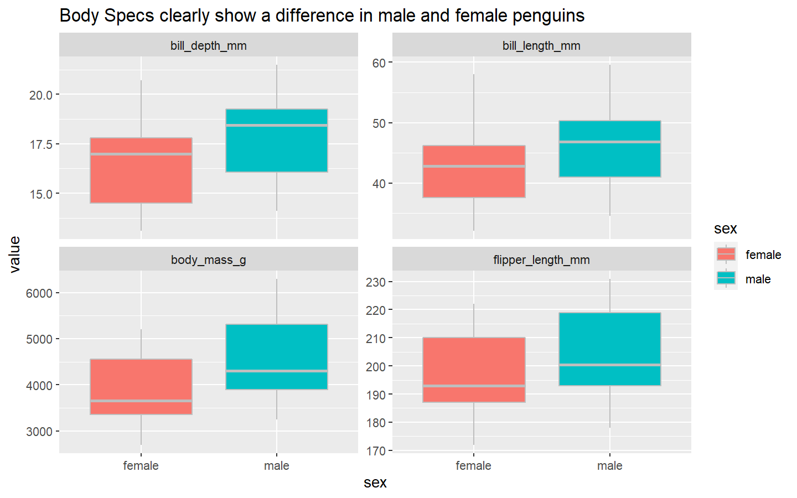

Tidymodels and Classification on Palmer Penguin Data
================
Gaurav Sharma
27/08/2020

# Reading the files

``` r
ttfile <- tidytuesdayR::tt_load('2020-07-28')
```

    ## 
    ##  Downloading file 1 of 2: `penguins.csv`
    ##  Downloading file 2 of 2: `penguins_raw.csv`

``` r
penguins <- ttfile$penguins
```

### let’s explore the data to see if we can find some good features to classify male and female penguins

``` r
penguins %>% 
    drop_na() %>%
    pivot_longer(bill_length_mm:body_mass_g, names_to = 'spec', values_to = 'value') %>% 
    ggplot(aes(x= value, y = sex, fill = sex)) +
    geom_boxplot(color = "gray") +
    facet_wrap(~spec, scales = "free_y") +
    coord_flip() +
    labs(title = "Body Specs clearly show a difference in male and female penguins")
```

<!-- -->

``` r
penguins %>% 
    filter(!is.na(sex)) %>% 
    ggplot(aes(flipper_length_mm, bill_length_mm, color = sex, size = body_mass_g)) +
    geom_point(alpha = 0.5) +
    facet_wrap(~species) +
    labs(title = "Flipper and bill length can be used to differentiate between male and female penguins")
```

<!-- -->
